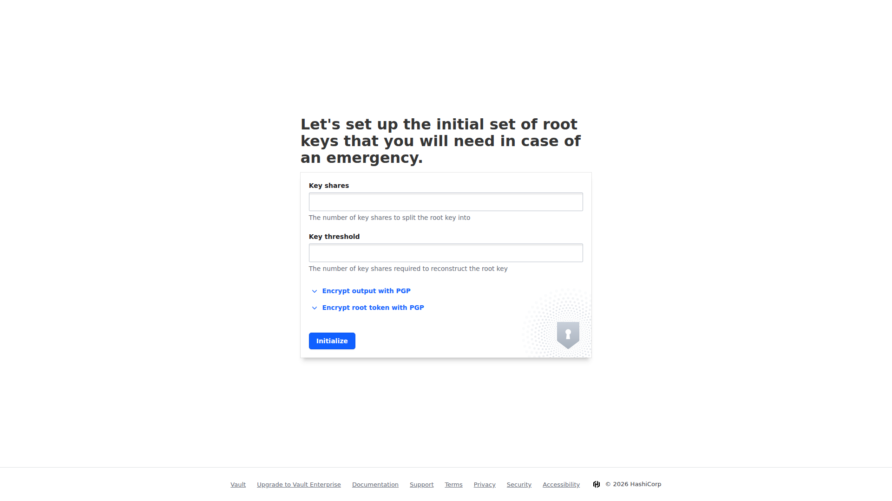
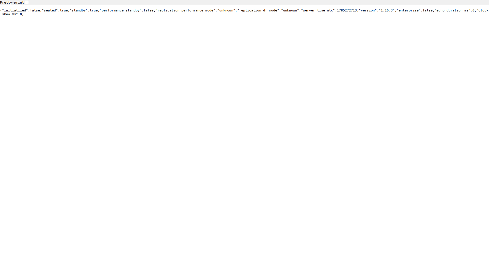

# Vault Secrets Management

HashiCorp Vault with Consul storage, policies, rotation scripts, Terraform provider, and a Flask consumer app.

## Workflow

```text
init-vault -> setup-secrets -> app reads via token -> rotate-secrets (scheduled)
```

## Quick start

```bash
make up
export VAULT_ADDR=http://127.0.0.1:8200
make init
source .vault-keys && export VAULT_TOKEN=$VAULT_ROOT_TOKEN
bash scripts/setup-secrets.sh
curl http://localhost:5000/secrets/db
```

## License

MIT

## Live Screenshots

### Vault UI


### Vault Health


## Live Screenshots

### Vault UI


### Vault Health

